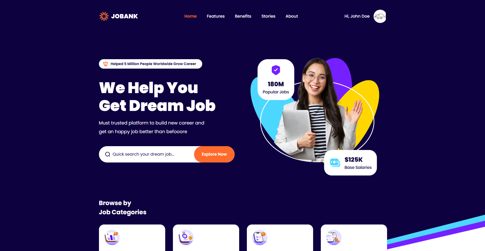

# **JOBANK - Job Portal Website**  
Live Preview - [https://jobank.jouxingngo.my.id/](https://jobank.jouxingngo.my.id/)
<br/>  
<div align="center">  
    
</div>  
<br/>  
<br/>

## 🛠 **Installation and Setup Instructions**

1. **Fork dan clone** repository ini. Pastikan Anda telah menginstal **NodeJs**, **Composer**, dan **Git** di mesin Anda.
   
2. Install dependensi:  
   ```bash  
   composer install && npm install
   
3. Di direktori proyek, jalankan:  
   ```bash  
   php artisan serve
   npm run dev
   
4. Migrasi database: 
   ```bash  
   php artisan migrate

5. Seed database: 
   ```bash  
   php artisan db:seed 


## 🚀 **Usage Instructions**

1. **Login ke halaman super admin** :  
   - **https://jobank.jouxingngo.my.id/login**
   - **Email**: `super@admin.com`  
   - **Password**: `123123123`

---

## 📞 **Contact Me**

Jika Anda memiliki pertanyaan atau umpan balik, silakan hubungi saya di **Instagram**: [@jouxing_ngo](https://instagram.com/jouxing_ngo).

---

## ⭐ **Show your support**

Jika Anda menyukai aplikasi ini, jangan lupa untuk memberikan **⭐**! Dukungan Anda sangat berarti bagi pengembangan proyek ini.


